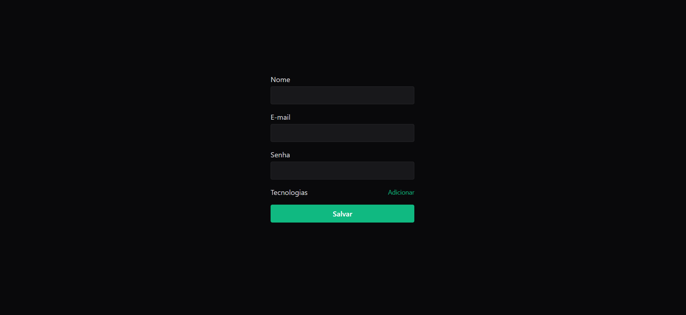

<h1>Forms Advanced</h1>
Forms Advanced é um projeto que desenvolve um formulário com validações de dados e inserção de novos campos durante 
o preenchimento. Feito em React com o hook react-hook-forms e estilizado em tailwindcss com validações de dados atravez do zod. 

<h4>Tecnologias Utilizadas:</h4>

    React
    React-hook-forms
    Tailwindcss
    Zod